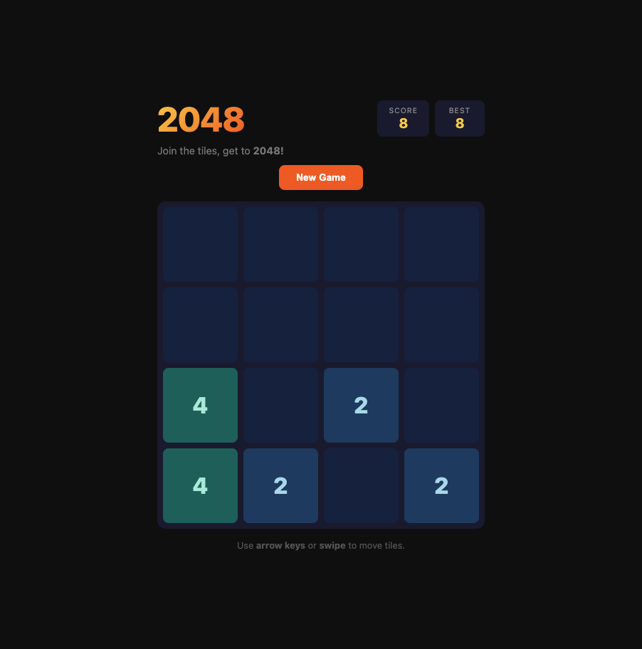

# 2048

A clean, animated 2048 puzzle game built with vanilla JavaScript — no frameworks, no dependencies.



## Play

**[Play Now](https://2048-game-ezechias1.vercel.app)**

## Features

- Smooth tile slide and merge animations
- Swipe support for mobile
- Score tracking with persistent best score
- Dark theme with vibrant tile colors
- Fully responsive — works on any screen size
- Zero dependencies — pure HTML, CSS, and JS

## How to Play

1. Use **arrow keys** (desktop) or **swipe** (mobile) to slide tiles
2. Tiles with the same number **merge** when they collide
3. Each merge adds to your score
4. Reach **2048** to win — or keep going for a higher score!

## Tech Stack

- HTML5
- CSS3 (Grid, animations, transitions)
- Vanilla JavaScript (ES5)

## Run Locally

```bash
git clone https://github.com/ezechias1/2048-game.git
cd 2048-game
open index.html
```

## License

MIT
